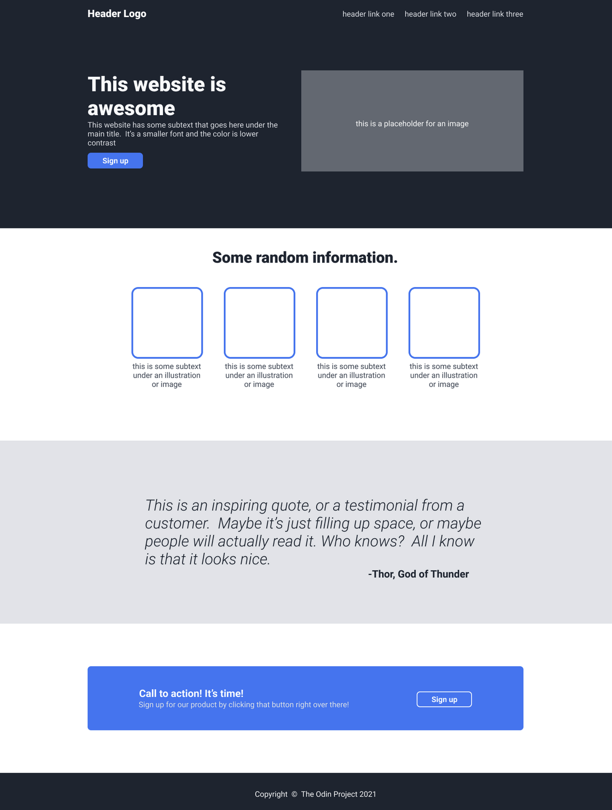

# CodeGuard Labs Landing Page

This project is part of the [Odin Project](https://theodinproject.com) Foundations Course, specifically the "Landing Page" project in the CSS Flexbox Section. The assignment focuses on applying skills learned in HTML and CSS fundamentals, including the use of Grid and Flexbox. Additionally, I introduced some concepts not yet covered in the course, such as simple animations and responsive design for mobile devices.

## Project Overview

The goal of this project was to create a landing page using a layout and design template provided by the Odin Project. The Odin Project's version of the landing page is below:

## What is CodeGuard Labs?

CodeGuard Labs is a fictional Quality Assurance company I conceived for the purpose of customizing this project. I created the logo in Figma. The laptop image was sourced from [Unsplash](https://unsplash.com/).

Thank you for viewing!